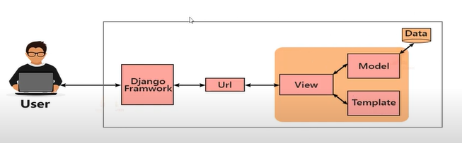

# What is MVT?
Ans: Django is based on MVT (Model,View,Template) architecture. MVT is a software design pattern for developing a web application.

# MVT Structure

## Description of the Image
The image represents the Model-View-Template (MVT) structure used in Django framework development. It highlights the interaction flow:

- **User:** Initiates interaction through a request (e.g., entering a URL).
- **Django Framework:** Acts as the core system managing the flow between user input and web output.
- **URL to View:** The URL directs to the corresponding View, which processes the request.
- **View to Model and Template:**
  - **Model:** Handles data and communicates with the database.
  - **Template:** Handles the presentation logic and renders the output.

This cycle ensures a smooth request-response workflow in Django web applications.

## Additional Details

- **Key Elements:**
  - `User` sends a request.
  - `View` processes logic and interacts with `Model` and `Template`.
  - Final output is rendered back to the `User`.

- **Learning Pathways:**
  - **Django Basics to Advanced**: Start from understanding this structure to building advanced web applications.
  - **Study Resources**: Framework guides like AI Quest or Study Mart are excellent supplementary materials.

# MVT vs. MVC Comparison

| Model View Template (MVT)           | Model View Controller (MVC)           |
|-------------------------------------|---------------------------------------|
| MVT has Views for receiving HTTP request and returning HTTP response. | MVC has a controller that drives both Model and View. |
| Templates tell how the user data will be presented.                 | View tells how the user data will be presented.      |
| The controller part is managed by the framework itself.             | You have to write all the control-specific code.     |
| Modifications are easy.                                               | Modifications are difficult.                        |
| Suitable for both small and large applications.                     | Suitable for the development of large applications but not for small applications. |
| Django uses MVT pattern.                                            | ASP.NET, Spring                                     |

## MVT to MVC Mapping

| MVT      | MVC        |
|----------|------------|
| Model    | Model      |
| Template | View       |
| View     | Controller |

## Descriptions

- **Models**: Describes your data from the database
- **Views**: Controls what users see
- **Templates**: How users see it
- **Controller**: URL dispatcher

# URL Dispatcher in Django MVT

In Django's MVT (Model-View-Template) architecture, the component that serves the function of a "URL dispatcher" similar to the Controller in MVC (Model-View-Controller) is the URLconf module.

The URLconf (URL configuration) module is responsible for mapping URL patterns to views. It acts as the URL dispatcher, directing incoming HTTP requests to the appropriate view functions based on the URL patterns defined in the `urls.py` file.

## Overview

- **URLconf (URL dispatcher)**: Maps URL patterns to view functions, directing HTTP requests to the appropriate views based on the defined URL patterns.
